# Day 5 – IF-ELSE, CASE, and Looping Constructs

This document covers correct and incorrect RTL coding styles in Verilog, with a focus on **priority logic**, **selection logic**, **inferred latches**, and **looping constructs** (procedural vs. generate). Each lab includes the RTL code, observed behavior, waveform, synthesized netlist, and key learning outcomes.

---

## Table of Contents

- [RTL Coding Styles: IF-ELSE and CASE Statements](#rtl-coding-styles-if-else-and-case-statements)
- [Inferred Latches](#inferred-latches)
- [Labs 1–2: Incomplete IF Statements](#labs-12-incomplete-if-statements)
- [Labs 3–5: CASE Statements](#labs-35-case-statements)
- [Lab 6: Overlapping CASE Statements](#lab-6-overlapping-case-statements-bad_casev)
- [Redundancy Optimization During Synthesis](#redundancy-optimization-during-synthesis)
- [Looping Constructs in Verilog](#looping-constructs-in-verilog)
- [Labs 7–10: Loop-Based MUX, DEMUX, and RCA](#labs-710-loop-based-mux-demux-and-rca)
- [Overall Summary](#overall-summary)

---

## RTL Coding Styles: IF-ELSE and CASE Statements

Correct RTL coding practices are essential for ensuring that synthesized hardware behaves exactly as intended. Improper coding styles can introduce unintended hardware elements such as latches, leading to simulation-synthesis mismatches and unreliable circuit behavior.

### Priority Logic using IF-ELSE Statements

The `if-else` construct implements **priority logic**. Conditions are evaluated sequentially from top to bottom — once a condition evaluates true, its block executes and the remaining conditions are ignored.

```verilog
if (condition1) statement1;
else if (condition2) statement2;
else statement3;
```

**Priority order:**

| Level | Construct | Behavior |
|---|---|---|
| Highest | `if` | Evaluated first |
| Middle | `else if` | Evaluated only if prior conditions are false |
| Lowest | `else` | Executed when none of the above match |

This style is used whenever one condition must take priority over another.

### CASE Statements

A `case` statement selects one execution path based on the value of a single expression. Unlike an if-else ladder, `case` does **not** represent priority logic — the input is compared against each item, and only the matching branch executes.

```verilog
always @(*) begin
  case (sel)
    2'b00 : y = a;
    2'b01 : y = b;
    default : y = 0;
  endcase
end
```

`case` statements provide cleaner, more readable implementations for decoders, multiplexers, and state machines.

### IF-ELSE vs. CASE

| | IF-ELSE | CASE |
|---|---|---|
| Logic type | Priority logic | Selection logic |
| Evaluation | Sequential | Matched against case items |
| Execution | First true condition | Only the matching branch |
| Best for | Priority encoders, conditional logic | Multiplexers, decoders, FSMs |

---

## Inferred Latches

A **latch** is a level-sensitive storage element that retains its previous value until reassigned. During synthesis, if an RTL description does not specify the output for every possible input condition, the tool automatically inserts a latch to preserve the previous value — this is called an **inferred latch**.

In combinational logic, outputs should depend only on current inputs. Unintentional latch inference is poor practice because it introduces unwanted memory into what should be purely combinational hardware.

### Why the Counter Does Not Infer a Latch

```verilog
always @(posedge clk or posedge reset) begin
  if (reset) count <= 0;
  else if (enable) count <= count + 1;
end
```

Even without a final `else`, this does **not** infer a latch — the circuit is **sequential**, not combinational. `count` is stored in a flip-flop, which naturally holds its value when `enable` is inactive. This is the intended behavior of a flip-flop, not an unintended latch.

---

## Labs 1–2: Incomplete IF Statements

### Lab 1: Incomplete IF Statement (`incomp_if.v`)

```verilog
always @(*) begin
  if (i0) y = i1;
end
```

`y` is only assigned when `i0` is high. When `i0` is low, no assignment occurs, so synthesis infers a **D-latch** to hold the previous value.

| Condition | Result |
|---|---|
| `i0 = 1` | `y` follows `i1` |
| `i0 = 0` | No assignment → previous value retained (latch) |

**Waveform**

<p align="center">
  
</p>

**Synthesized Netlist**

<p align="center">
  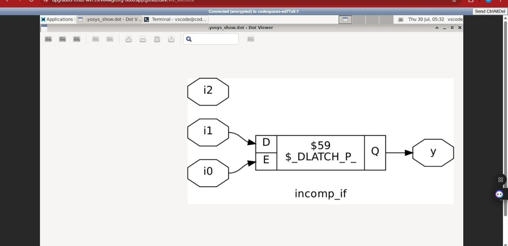
</p>

**Learning Outcome:** Every output in a combinational `always @(*)` block must be assigned for all input conditions.

### Lab 2: Incomplete IF-ELSE Statement (`incomp_if2.v`)

```verilog
always @(*) begin
  if (i0) y = i1;
  else if (i2) y = i3;
end
```

If both `i0` and `i2` are low, `y` is left unassigned, and a latch is inferred.

| Condition | Result |
|---|---|
| `i0 = 1` | `y = i1` |
| `i0 = 0, i2 = 1` | `y = i3` |
| `i0 = 0, i2 = 0` | No assignment → latch inferred |

**Waveform**

<p align="center">
  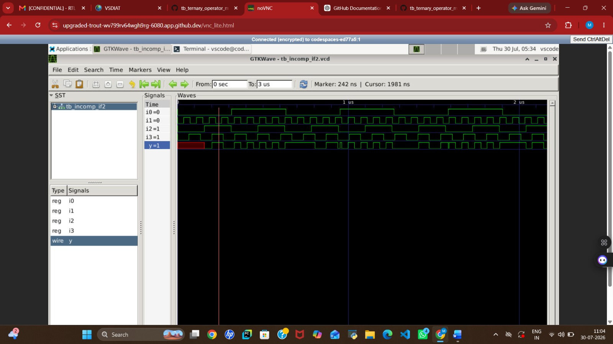
</p>

**Synthesized Netlist**

<p align="center">
  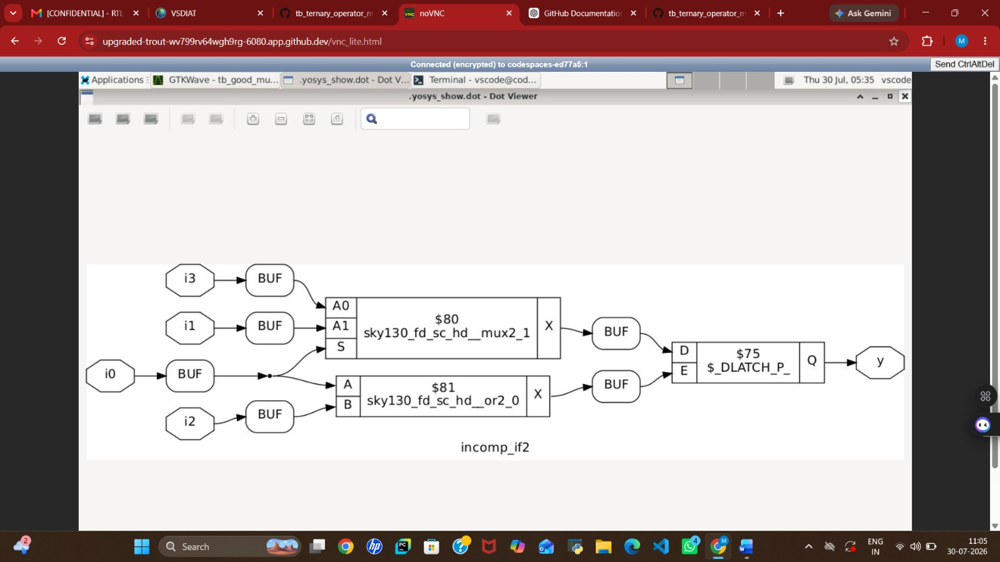
</p>

**Learning Outcome:** Adding `else if` alone doesn't prevent latch inference — a final `else` is required to cover every path.

---

## Labs 3–5: CASE Statements

### Lab 3: Incomplete CASE Statement (`incomp_case.v`)

```verilog
always @(*) begin
  case (sel)
    2'b00 : y = i0;
    2'b01 : y = i1;
  endcase
end
```

| `sel` | Output |
|---|---|
| `2'b00` | `y = i0` |
| `2'b01` | `y = i1` |
| `2'b10` | Previous value retained (latch) |
| `2'b11` | Previous value retained (latch) |

**Waveform**

<p align="center">
  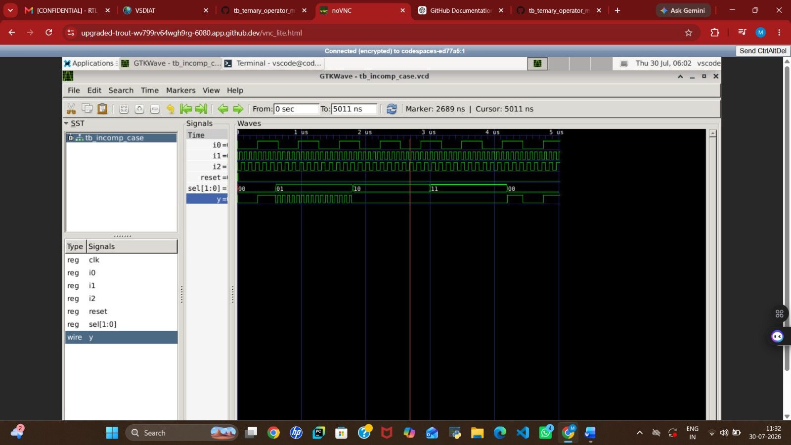
</p>

**Synthesized Netlist**

<p align="center">
  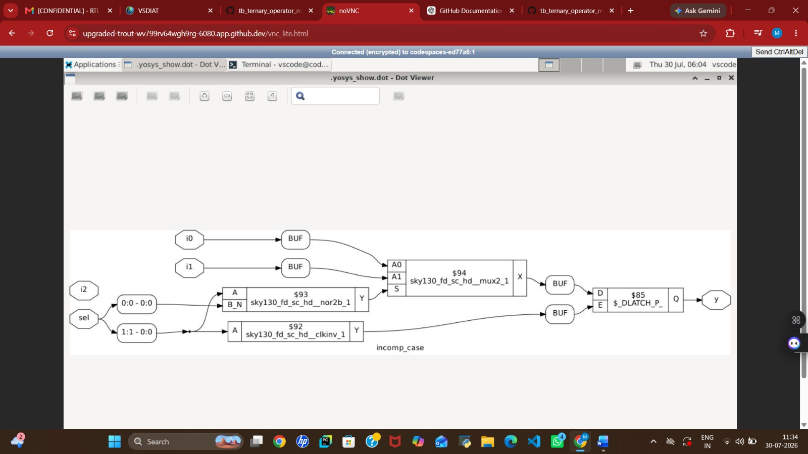
</p>

**Learning Outcome:** Uncovered `sel` values with no `default` branch cause latch inference.

### Lab 4: Complete CASE Statement (`comp_case.v`)

```verilog
always @(*) begin
  case (sel)
    2'b00 : y = i0;
    2'b01 : y = i1;
    default : y = i2;
  endcase
end
```

| `sel` | Output |
|---|---|
| `2'b00` | `y = i0` |
| `2'b01` | `y = i1` |
| `2'b10` | `y = i2` |
| `2'b11` | `y = i2` |

**Waveform**

<p align="center">
  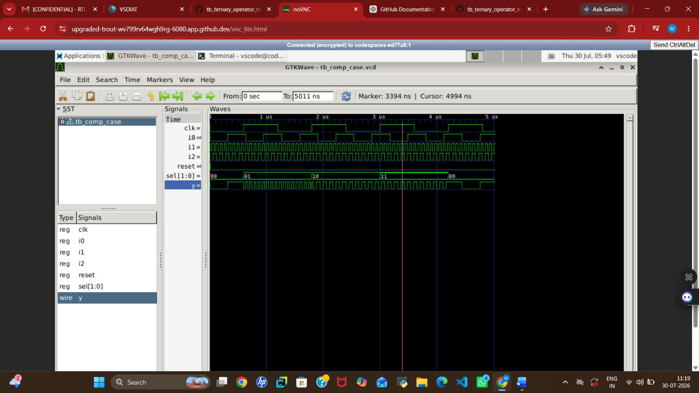
</p>

**Synthesized Netlist**

<p align="center">
  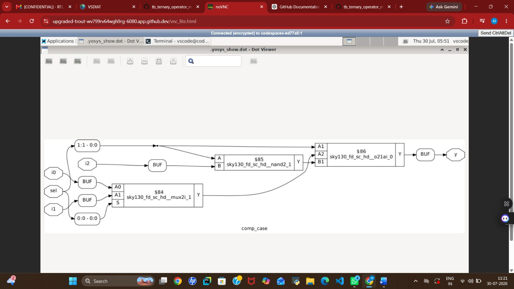
</p>

**Learning Outcome:** A `default` branch guarantees every input value is covered, eliminating latch inference.

### Lab 5: Partial Output Assignment in CASE Statement (`partial_case_assign.v`)

```verilog
always @(*) begin
  case (sel)
    2'b00: begin
      y = i0;
      x = i2;
    end
    2'b01: begin
      y = i1;
    end
    default: begin
      y = i3;
      x = i4;
    end
  endcase
end
```

`x` is unassigned in the `2'b01` branch, so a latch is inferred **only for `x`**.

| `sel` | `y` | `x` |
|---|---|---|
| `2'b00` | `i0` | `i2` |
| `2'b01` | `i1` | Previous value (latch) |
| default | `i3` | `i4` |

**Synthesized Netlist**

<p align="center">
  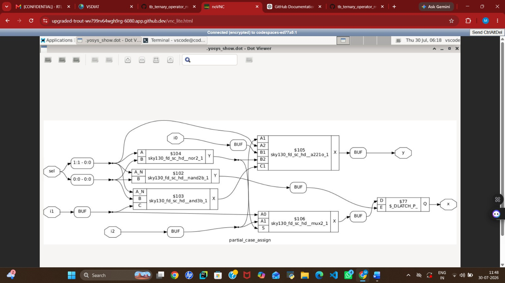
</p>

**Learning Outcome:** When multiple outputs are driven inside a `case`, **every** output must be assigned in **every** branch.

---

## Lab 6: Overlapping CASE Statements (`bad_case.v`)

This lab illustrates a different issue: **overlapping case items** — not latch inference.

```verilog
always @(*) begin
  casez (sel)
    2'b00 : y = i0;
    2'b01 : y = i1;
    2'b10 : y = i2;
    2'b1? : y = i3;
  endcase
end
```

The pattern `2'b1?` matches both `2'b10` and `2'b11`, but `2'b10` is already explicitly defined earlier. This means `sel = 2'b10` matches **two** case items.

| `sel` | Matching Case(s) | Output |
|---|---|---|
| `2'b00` | `2'b00` | `y = i0` |
| `2'b01` | `2'b01` | `y = i1` |
| `2'b10` | `2'b10` **and** `2'b1?` | Ambiguous |
| `2'b11` | `2'b1?` | `y = i3` |

Verilog simulators resolve overlaps by taking the **first match**, but synthesis tools may optimize differently — leading to **simulation-synthesis mismatches**, even though no latch is inferred.

**Waveform**

<p align="center">
  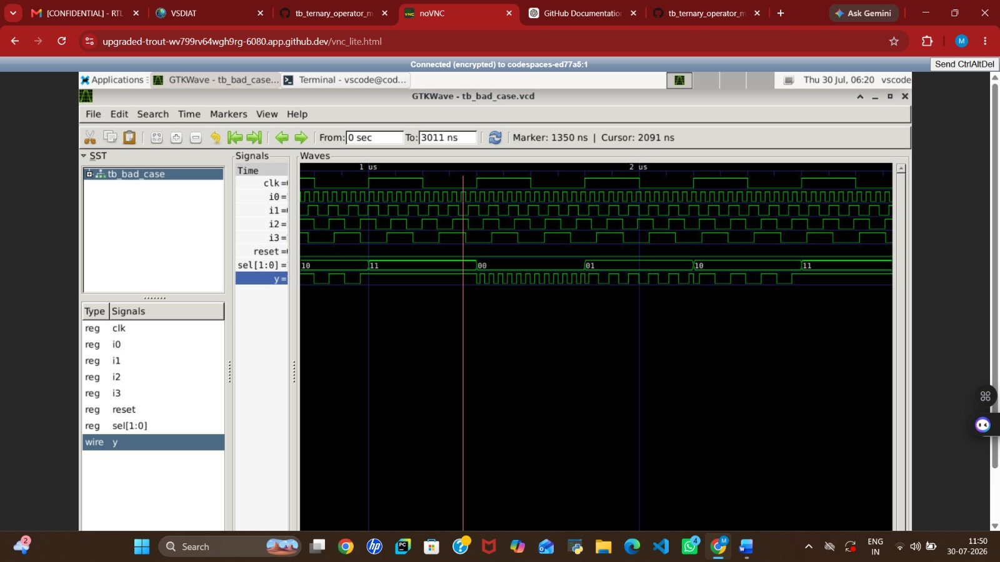
</p>

**Learning Outcome:** Case items should be mutually exclusive. Avoid overlapping wildcard patterns (`?`, `z`) unless carefully designed.

---

## Redundancy Optimization During Synthesis

Synthesis tools such as Yosys automatically apply Boolean logic optimizations. For example:

```
S1'·S0' + S1  =  S1 + S0'   (Redundancy Theorem)
```

This reduces gate count, silicon area, and can improve timing/power — while preserving functional equivalence between RTL and the gate-level netlist.

---

## Looping Constructs in Verilog

Verilog offers two distinct looping constructs that look similar but serve very different purposes.

### Procedural `for` Loop

Used **inside** an `always` block. It does not create hardware instances — it repeatedly evaluates logic during simulation/synthesis to make RTL more compact.

| Feature | Detail |
|---|---|
| Location | Inside `always` |
| Creates hardware? | No |
| Use case | MUX, DEMUX, counters, combinational logic |
| Executes | During procedural execution |

**Example — 2:1 MUX simplification:**

```verilog
// Case-based
always @(*) begin
  case (sel)
    1'b0 : y = i0;
    1'b1 : y = i1;
  endcase
end

// Equivalent ternary form
assign y = sel ? i1 : i0;
```

For a **4:1 MUX**, a procedural `for` loop compares the select signal against each input index, avoiding repetitive `case` items. The same approach applies to **demultiplexers**: initialize all outputs to zero, then use the loop index to activate only the selected output line.

### Generate `for` Loop

Used **outside** `always` blocks to instantiate multiple hardware copies during elaboration.

| Feature | Detail |
|---|---|
| Location | Outside `always` |
| Creates hardware? | Yes |
| Use case | Adders, register arrays, repeated modules |
| Executes | During elaboration, before synthesis |

**Example — Ripple Carry Adder:** Instead of manually instantiating each Full Adder, a `generate` loop instantiates one Full Adder per bit, chaining carry-out to the next stage's carry-in.

### Procedural vs. Generate — Summary

| Feature | Procedural `for` Loop | Generate `for` Loop |
|---|---|---|
| Location | Inside `always` block | Outside `always` block |
| Purpose | Evaluates expressions | Creates hardware instances |
| Hardware instantiation | No | Yes |
| Typical use | MUX, DEMUX, counters | Adders, register arrays |
| Execution stage | Procedural execution | Elaboration (pre-synthesis) |

---

## Labs 7–10: Loop-Based MUX, DEMUX, and RCA

### Lab 7: Multiplexer Using Procedural `for` Loop (`mux_generate.v`)

Implements a MUX by iterating through input indices and comparing each to `sel`, instead of writing explicit `case` items.

- ✅ Correct input selected for all `sel` values.
- ✅ Synthesis produced hardware equivalent to a conventional MUX.

**Waveform**

<p align="center">
  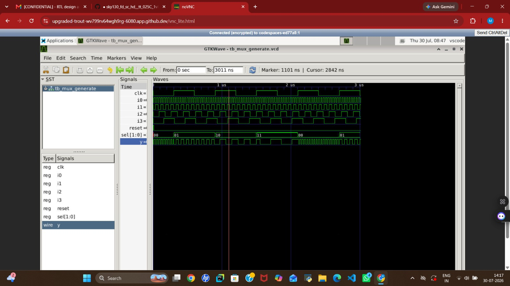
</p>

**Learning Outcome:** Procedural loops eliminate repetitive statements while preserving identical synthesized functionality.

### Lab 8: Demultiplexer Using CASE Statement (`demux_case.v`)

Routes a single input to one of several outputs based on `sel`, with each value explicitly handled in the `case`.

- ✅ Only the selected output activates; all others remain inactive.

**Learning Outcome:** `case` statements are simple and readable for DEMUX designs with a small number of outputs.

### Lab 9: Demultiplexer Using Procedural `for` Loop (`demux_generate.v`)

Same functionality as Lab 8, implemented with a loop instead of manual `case` items.

| | CASE Statement | Procedural `for` Loop |
|---|---|---|
| Coding effort | Manual, per-branch | Single loop for all outputs |
| Scalability | Less scalable | Easily scales to wide buses |
| Style | More repetitive | Compact, maintainable |

**Waveform**

<p align="center">
  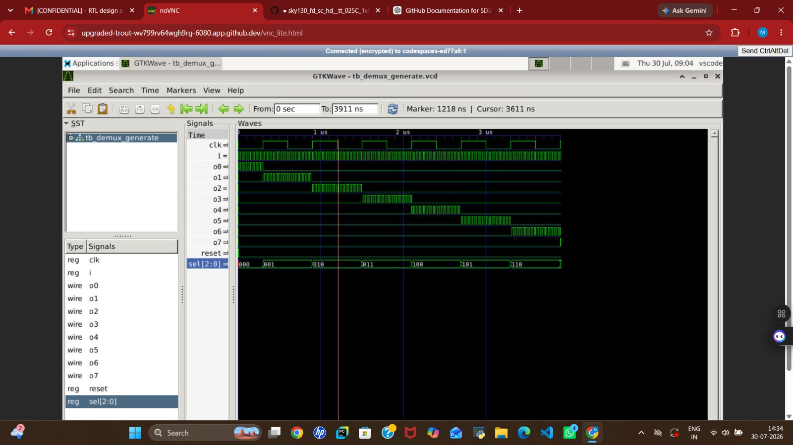
</p>

**Synthesized Netlist**

<p align="center">
  
</p>

**Learning Outcome:** Procedural loops improve scalability and readability without changing synthesized hardware.

### Lab 10: Ripple Carry Adder Using Generate `for` Loop (`rca.v`)

Automatically instantiates one Full Adder per bit using a `generate` loop, with carry propagating from stage to stage.

- ✅ Full Adder instances generated automatically during elaboration.
- ✅ Carry propagated correctly across all stages.
- ✅ Functional simulation and synthesis both verified correct addition.

**Waveform**

<p align="center">
  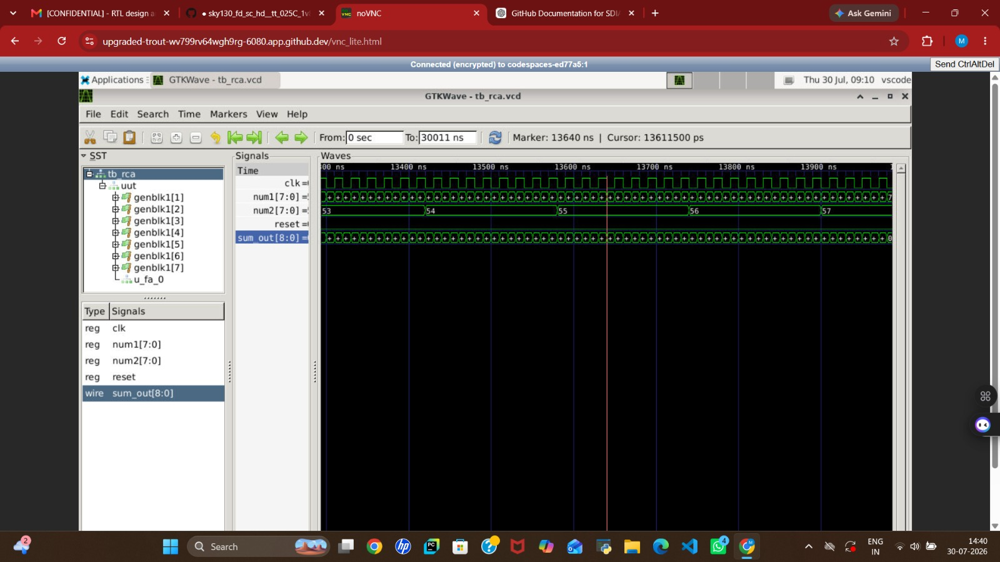
</p>

**Synthesized Netlist**

<p align="center">
  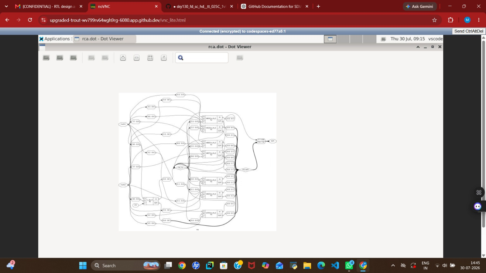
</p>

**Gate-Level Simulation (GLS) Waveform**

<p align="center">
  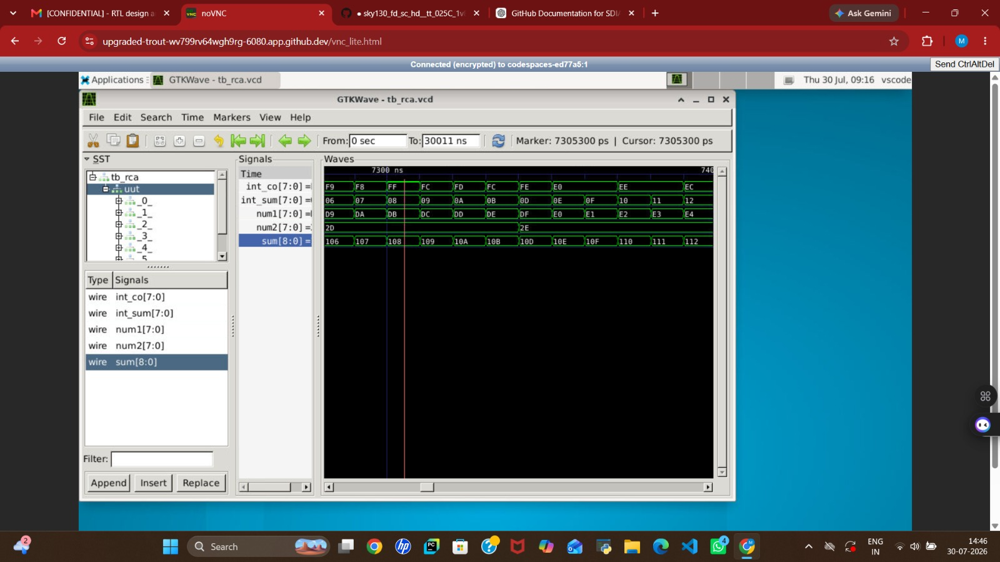
</p>

The GLS waveform, generated by simulating the synthesized netlist with the SKY130 primitive models, matches the RTL simulation waveform — confirming that synthesis preserved functional correctness.

**Learning Outcome:** `generate` loops are a powerful, scalable method for repetitive hardware structures — RCAs, register arrays, arithmetic units, and bus-oriented circuits.

---

## Overall Summary

- **IF-ELSE** implements priority logic; **CASE** implements selection logic.
- Missing assignments in combinational logic (`if`, `case`) cause **inferred latches** — always cover every path, and assign every output in every branch.
- Flip-flops in **sequential** logic intentionally retain state; this is normal and does *not* involve inferred latches.
- **Overlapping case items** cause simulation-synthesis mismatches without inferring latches — keep case items mutually exclusive.
- Synthesis tools apply Boolean optimizations (e.g., the Redundancy Theorem) to produce efficient, functionally equivalent gate-level netlists.
- **Procedural `for` loops** simplify repetitive logic inside `always` blocks (MUX/DEMUX) without creating extra hardware.
- **Generate `for` loops** instantiate multiple hardware copies at elaboration time, ideal for scalable structures like Ripple Carry Adders.

Following these RTL coding guidelines ensures that simulation, synthesis, and gate-level simulation remain consistent and predictable.

### RTL Coding Guidelines Checklist

- [ ] Use `always @(*)` for combinational logic.
- [ ] Assign every output signal in all possible execution paths.
- [ ] Always include an `else` branch in combinational `if` statements.
- [ ] Always include a `default` branch in `case` statements.
- [ ] Assign all output variables in every `case` branch.
- [ ] Use non-blocking assignments (`<=`) inside clocked sequential logic.
- [ ] Avoid unintended inferred latches in combinational circuits.
- [ ] Keep `case`/`casez` items mutually exclusive.
